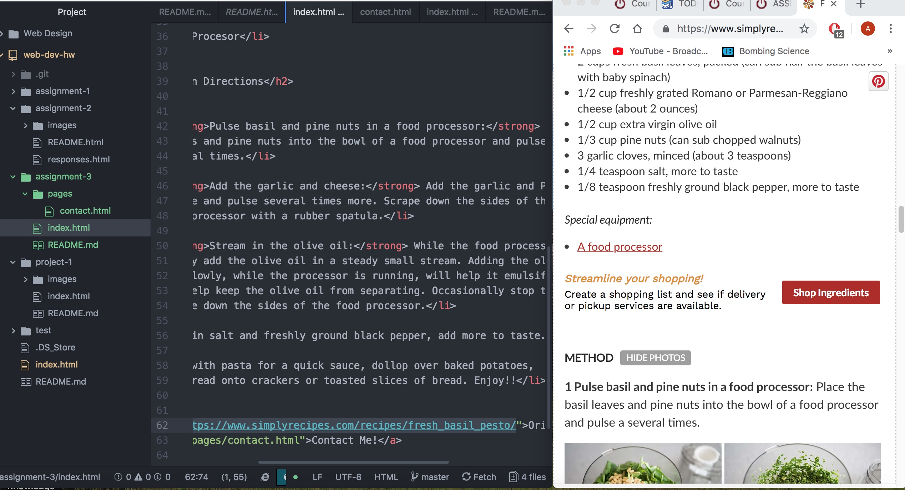

<!DOCTYPE html>
      <h2>Assignment-3 Responses</h2>

<body>
  

    The head and body elements in the HTML are very important. Including multiple
    of these can mess up an entire page. This is because these elements are specific
    in organization of the code. The head contains high level information about
    the site and is always placed first, therefore multiple uses of the head would
    confuse how the code is analysed. The body element is what contains much of
    what the viewer see's, it contains much of the presented information. There is
    an order that the code is read and loaded in and having multiple head or body
    elements would effect how it is transcribed.

    There are two types of markup code that are used and these are semantic and structural
    elements. Structural elements are what hold the information about the document
    structure. These elements change the appearence but usually do not hold the main
    information. Semantic elements in code are elements that reinforce the meaning
    of the information and not just the presentation.

    Throughout this week I spent more time exploring videos and tutorials while working
    on this assignment. I had some troubles linking locally, still unsure if the Links
    between the contact and index are working. Other than this working through this
    assignment was smooth.
  

      
</body>
