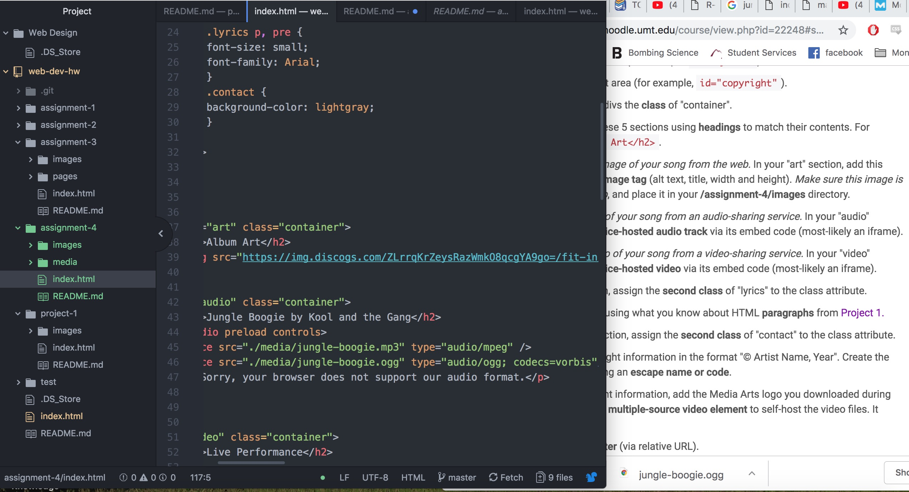

<h1> Assignment 4 README <h1/>

There are multiple levels and elements that can go inside the body of a document, some examples of these would be div, ids, classes, and spans. However these are all different pieces that work together. A div usually holds larger pieces of code than a span. Ids and classes are similar in the fact that they are indentfiers and usually lie within the larger div or span elements. An Id however must be unique, there cannot be two of the same ids. Unlike the id, classes can be used multiple times in one document.

 Alt text is a required element when sourcing and using images in HTML. This element describes the appearance and function of an image on a page. This can help the visually impaired as well as make code much easier to read and understand.

This weeks assignment went well, the way we went about this weeks material made it easy to understand. Week to week each site is looking better and better. One issue that I had this week was with sourcing the video to autoplay on the site. I used the embedded code that is given on youtube and sometimes the video gives and error message.
  

  
