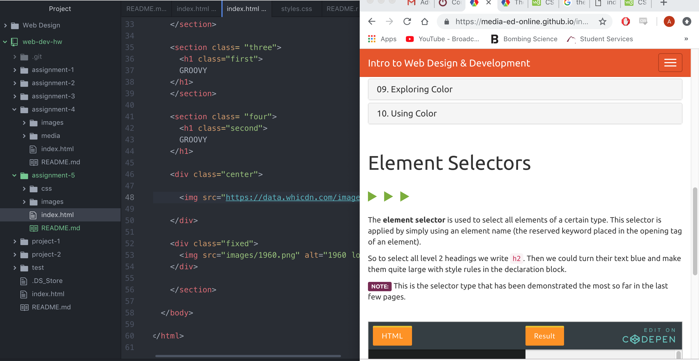

<h1> Assignment 5 README <h1/>

  This weeks topic was very open, we had to choose one decade and theme a page with this style. I choose the 60s to work with, this time period seemed to be all about color and design. The colors are very bright and flashy,I used a classic hippy-like background img. I choose an iconic image of the Beatles to center the page and be the main element.

  For my color palette I tried to choose colors that resembled the 60s but also go together. I used rgb(228, 151, 143),rgb(190, 65, 156), rgb(192, 24, 96), and rgb(54, 217, 217).

  This weeks assignment went well, I didn't have many issues with my site. I had some issues with some details like opacity and fonts changing other elements as well. But with some tinkering and exploration it turned out well. I really enjoyed the intro to CSS it makes designing a site much more artistic and fun. This weeks assignment was perfect for the introduction in to CSS.
  

  
