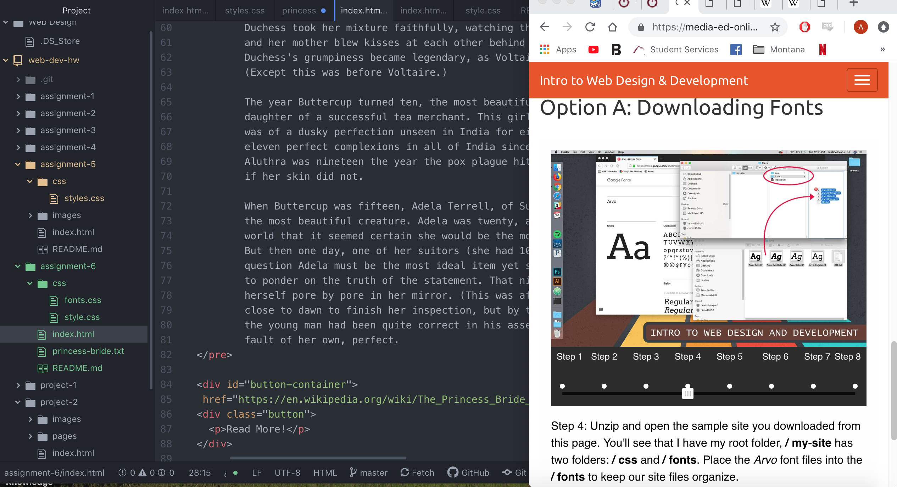

<h1> Assignment 6 README <h1/>

  I choose some cursive type fonts that went along with my focus which was The Princess Bride film. I also used a fantasy style font which was similar to the cursive style. These fonts went well with my color and theme and that is why I chose them.

  A desktop font is the type of font that is already on your computer via applications like word. This font is installed and can be used in most apps. A web font is a font that can be downloaded/used off of the web. Some system however cannot load/use these fonts even though they can bring extra flair and detail into web pages without them. Having fallback fonts makes sense when you are using fonts that may not beable to load on some systems. But can seem somewhat unessesary with fonts are are adaptable to all formats.

  During this work week I was unfortunately pushed to spend less time on this project with other stupid finals needs. This was somewhat frustrating when I could not really dig in to the material. I didn't have many issues this week other that the button. I had a very hard time getting the button to work with tutorials on the page. Instead I just looked at the example code and pieced it together bit by bit. I defenetly like the newer material that we have been working with it is much more stylish and interesting.
  

  
