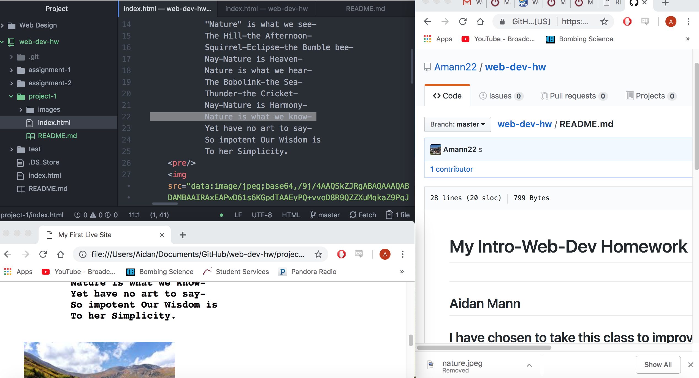

<h1>README.md-Project 1 Report<h1/>

<pre>
  I used mainly google chrome.
  All browsers have small differences in code interpretation, interface, rendering,
  and engines. The browser is what takes your or anybodies code from the web
  renders and displays it. Each uses different interpreters to understand varieties
  of coding languages. They are constantly updating and changing, they all have
  pros and cons depending on what you are looking to do.
<pre/>

<pre>
  The wayback machine is absolutely incredible, I loved to explore and interact.
  It was very cool to take a look at very popular websites like youtube and mtv,
  but I think the most interesting thing was to view sites like nytimes and other
  news sites. It gave me a glance into not only what the internet was like but
  what was going on in the world arounf those times.
<pre/>

<pre>
  My work on this project was somewhat sporadic, I am just starting my post-surgery
  recovery and getting back into school. I liked this project alot, it have alot
  of freedom of what we would like to work with but at the same time helped me
  learn more. Ive been having some issues getting my sites to go live but it just
  takes me time and a higher importance of organization than what I am used to.
  I didn't find the need to post up about any issues ussually I just need more time
  to experiment and use past sites to check my work.
<pre/>

  
