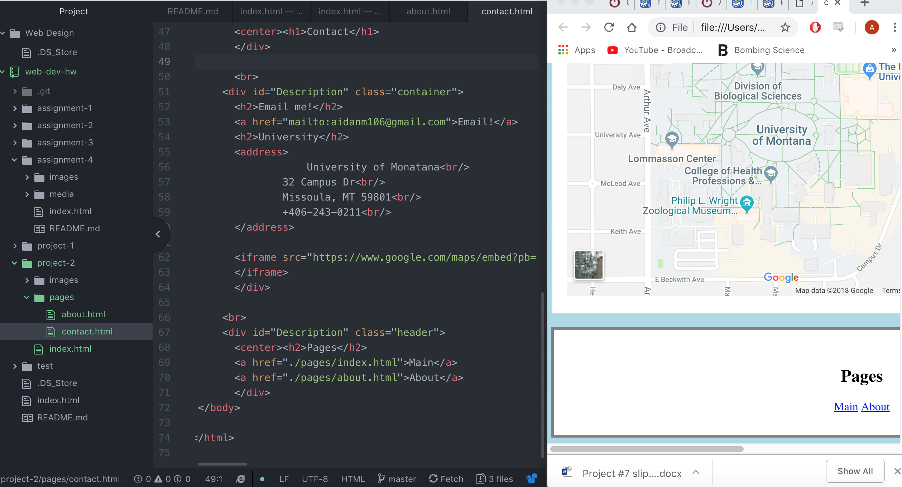

<h1> Project 2 README <h1/>

 Learning HTML for me was very interesting but difficult at the same time. I have taken the creative coding class so using atom and github was not new. This was a relief because I sometimes have trouble with technology. Overall I think I will use this for myself and others. 

 I am very excited to get into CSS. I like the websites that we have made but at this point they are getting a little boring and I would love to learn how to flare them up. I am wondering if we will every use past projects, I like some of the work we have done and would like to improve them!

 During this week I was forces to work al little faster than normal, I was only here for half the week and had to make the most of my time. I found myself going into past code to find small things that I had used, this made it easier for me. I liked how open the project was, we could really choose what we were interested in.

  
