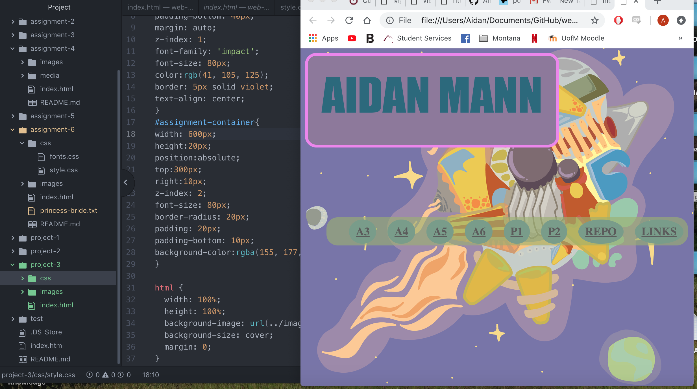

<h1> Project 3 README <h1/>

Content= What you create.

Padding= Smallest -This space goes all the way around your element. With padding you are able to change each side.

Border= Medium- Inside the margin the border goes       around the padding and content.

Margin= Large-This is the space around the border padding and the content. This surrounds everything, if the margin has 0 width its the edge and the same as the border.

    This week was very frustrating and I still cannot get my links to connect it always gives me an error unless I connect it to a different link page. What I did was add another link and hopefully I can possibly fix this. Overlapping elements also gave me some trouble but with some some experimentation I was able to figure it out.

    As I said previously this was one of the more frustrating weeks not only with alot of side things going on I had a hard time with this weeks assignment. This week the textbook helped me very much with overlapping and with sizing elements. I spent much of my time addressing the issue with linking and unfortunately I was unable to figure it out. What I did instead was add a link with working links to my assignment and I am working to fix the linking issue.
  

  
